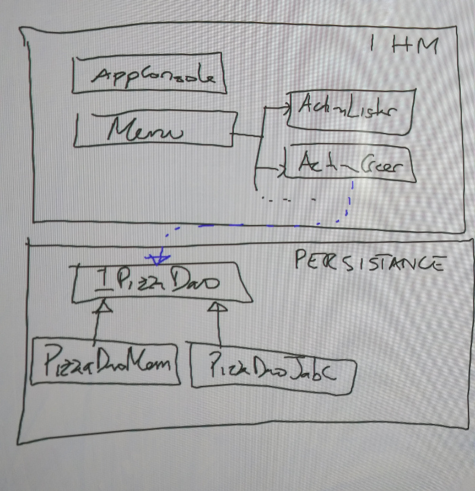

# Application Console Pizzéria

L'objectif est de créer une application Java qui permet d'administrer une pizzéria en mode console.

Exemple de menu :

```
** Application Pizzeria **
1. Lister pizzas
2. Créer une nouvelle pizza
3. Supprimer une pizza
99. Quitter

Veuillez sélectionner une action : _
```

Cette application est conçue sur une architecture 2-tiers :
* **Une couche IHM** : partie console responsable de l'intéraction avec l'utilisateur
* **Une couche Persistance** : responsable du stockage des données
	* Plusieurs implémentations ont été réalisées pour la partie persistance : stockage en mémoire, en base données via JDBC, en base de données via JPA.
	

	
	

